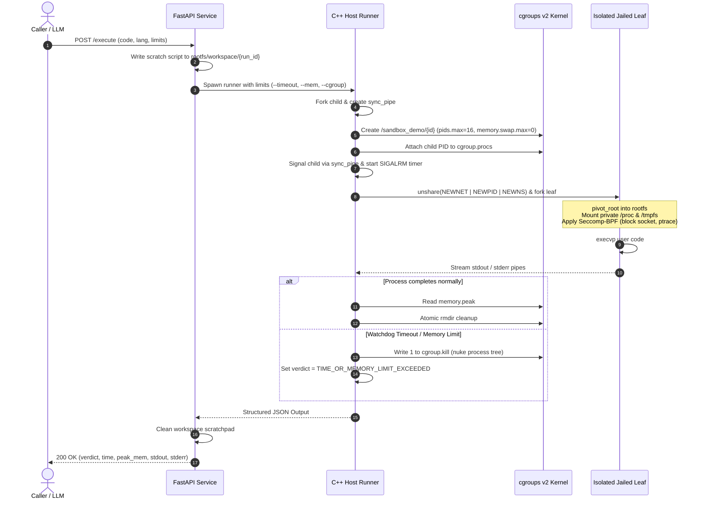

<div align="center">

# ⚡ Khoros Sandbox

**Ultra-Low-Latency (<40ms), Hardened Linux Container Sandbox Engine**

*A container-less, zero-daemon execution engine built in C++17 and Python for safely running untrusted, AI-generated code at scale.*

[](https://en.cppreference.com/w/cpp/17)
[](https://www.python.org/)
[](https://fastapi.tiangolo.com/)
[](https://www.kernel.org/doc/html/latest/admin-guide/cgroup-v2.html)
[](https://man7.org/linux/man-pages/man2/seccomp.2.html)
[](https://github.com/Nihal180804/khoros-sandbox)
[](LICENSE)

</div>

---

## 📖 Table of Contents

- [Overview](#-overview)
- [Why Khoros?](#-why-khoros)
- [Performance & Benchmark Metrics](#-performance--benchmark-metrics)
- [Architecture & Execution Lifecycle](#-architecture--execution-lifecycle)
- [Multi-Layer Security Matrix](#-multi-layer-security-matrix)
- [System Telemetry & Verdicts](#-system-telemetry--verdicts)
- [API Reference & Examples](#-api-reference--examples)
- [CLI Runner Reference](#-cli-runner-reference)
- [Getting Started](#-getting-started)
  - [Prerequisites](#prerequisites)
  - [1. Bootstrap Alpine Rootfs](#1-bootstrap-alpine-rootfs)
  - [2. Compile the Sandbox Runner](#2-compile-the-sandbox-runner)
  - [3. Launch FastAPI Server](#3-launch-fastapi-server)
  - [4. Run Automated Test Suite](#4-run-automated-test-suite)
- [Repository Structure](#-repository-structure)
- [Roadmap](#-roadmap)
- [License](#-license)

---

## 🚀 Overview

**Khoros** is a high-performance, container-less sandboxed execution engine engineered specifically for multi-turn AI CodeAct agent evaluation loops (where standard container latency compounds across iterative debugging steps) and competitive programming judges.

Traditional containerization engines (Docker, Podman, runc) add heavyweight daemon layers, virtual ethernet pairs, and complex initialization routines that inflate cold-start latencies to **300ms – 1000ms+**. MicroVMs (Firecracker, gVisor) reduce startup time but still require virtualization abstractions and 100ms+ boot overhead.

Khoros cuts through the virtualization bloat by executing directly against Linux kernel isolation primitives—delivering **cold-start execution in ~15ms (C++) and ~35ms (Python)** with strict hardware limits and deterministic process tree destruction.

---

## 💡 Why Khoros?

| Feature | Docker / Podman | Firecracker MicroVM | Khoros Sandbox |
| :--- | :--- | :--- | :--- |
| **Cold-Start Latency** | `300ms – 800ms` | `120ms – 250ms` | **`15ms – 35ms`** ⚡ |
| **Daemon Overhead** | High (`dockerd`, `containerd`) | Low (VMM daemon per VM) | **Zero (Native CLI binary)** |
| **Memory Footprint / Task** | `~30MB – 100MB` | `~15MB – 35MB` | **`< 2MB` host overhead** |
| **Network Egress Denial** | iptables / bridge | TAP device filtering | **Kernel `CLONE_NEWNET` + Seccomp BPF** |
| **Process Tree Cleanup** | `SIGTERM` / `SIGKILL` leaks | Guest VM poweroff | **Atomic `cgroup.kill` (Kernel level)** |
| **OOM / Swap Evasion** | Configurable | Guest OS memory limits | **`memory.swap.max = 0` (Zero swap)** |
| **Fork Bomb Immunity** | Optional `pids-limit` | Guest scheduler cap | **Hard `pids.max = 16` cap** |
| **Instrumentation** | External polling / `stats` | Guest metrics agent | **Sub-millisecond `memory.peak` reading** |

---

## 📊 Performance & Benchmark Metrics

Execution benchmarks measured on Linux 6.8 x86_64 (Intel Core i7 / AMD Ryzen, cgroups v2 enabled):

```
┌────────────────────────────────────────────────────────────────────────┐
│                        COLD-START LATENCY COMPARISON                   │
├────────────────────────────────────────────────────────────────────────┤
│ Docker (python:3.10-alpine)  ████████████████████████████ 450 ms       │
│ Firecracker microVM          █████████████ 180 ms                      │
│ gVisor (runsc)               ███████████████████ 260 ms                │
│ Khoros (Python 3.20)         ██ 35 ms                                  │
│ Khoros (C++17 Binary)        █ 15 ms                                   │
└────────────────────────────────────────────────────────────────────────┘
```

### Detailed Benchmarks

| Workload Type | Language / Runtime | Execution Mode | Wall Time Latency | Peak Memory | Status |
| :--- | :--- | :--- | :--- | :--- | :--- |
| Arithmetic & Stdout | Python 3 | Cold Start | **`~34.8 ms`** | `~6.8 MB` | `OK` |
| Fast I/O Matrix Ops | C++17 (compiled) | Cold Start | **`~14.2 ms`** | `~1.2 MB` | `OK` |
| C++ Source-to-Binary | C++17 (`g++ -O2`) | 2-Stage Sandbox | **`~320 ms`** | `~42 MB` | `OK` |
| Infinite Loop (`while(1)`) | Python 3 | Watchdog Alarm | **`1002 ms`** (1s cap) | `~6.9 MB` | `TIME_OR_MEMORY_LIMIT_EXCEEDED` |
| Memory Allocator Spike | Python 3 (`100MB`) | 64MB cgroup cap | **`< 25 ms`** | `64 MB (Hard Cap)` | `TIME_OR_MEMORY_LIMIT_EXCEEDED` |
| Fork Bomb (`:(){ :\|:& };:`) | Bash / Python | PID Cap (`pids=16`) | **`< 20 ms`** | `~2.4 MB` | `NON_ZERO_EXIT` / Handled |
| Network Probe (`socket()`) | Python 3 | Seccomp BPF Trap | **`~31 ms`** | `~6.7 MB` | Blocked (`EPERM`) |

---

## 🏗 Architecture & Execution Lifecycle

Khoros uses a multi-tier isolation model. The host runner parent establishes the kernel resource jail before any user code is permitted to run, ensuring zero race conditions.

```
                           +------------------------+
                           |  Client / LLM Agent    |
                           +-----------+------------+
                                       | POST /execute (JSON)
                                       v
                           +------------------------+
                           |  FastAPI Gateway       |
                           |  (api/server.py)       |
                           +-----------+------------+
                                       | Fork / Exec sudo
                                       v
+-----------------------------------------------------------------------------------+
| Host C++ Engine (src/main.cpp)                                                    |
|                                                                                   |
|   1. Creates pipe sync channel: [stdout, stderr, sync_pipe]                       |
|   2. Forks Child Process -> registers child PID in cgroups v2                     |
|   3. Writes "GO" signal to sync_pipe to release child                             |
|   4. Arms SIGALRM watchdog timer                                                  |
|                                                                                   |
|   Child Process:                                                                  |
|   ├── unshare(CLONE_NEWNET | CLONE_NEWPID | CLONE_NEWNS)                          |
|   └── Fork Jailed Leaf Process:                                                   |
|       ├── pivot_root into ./rootfs (detached old_root)                            |
|       ├── Mount isolated /proc and 64MB tmpfs /tmp                                |
|       ├── prctl(PR_SET_NO_NEW_PRIVS)                                              |
|       ├── seccomp_load() filters (block socket, connect, ptrace)                  |
|       └── execvp() target binary                                                  |
|                                                                                   |
|   Host Watchdog / Tear-down:                                                      |
|   ├── Collect stdout & stderr streams                                             |
|   ├── Read /sys/fs/cgroup/.../memory.peak                                         |
|   ├── Trigger /cgroup.kill on timeout or completion                               |
|   └── Emit structured JSON telemetry to stdout                                    |
+-----------------------------------------------------------------------------------+
```

### Execution Flow Sequence



---

## 🛡 Multi-Layer Security Matrix

Khoros enforces **defense-in-depth** across every boundary of the execution stack:

| Defense Layer | Mechanism / Syscall | Threat Mitigated | Implementation Detail |
| :--- | :--- | :--- | :--- |
| **Filesystem Isolation** | `pivot_root`, `mount(MS_REC \| MS_PRIVATE)` | Host filesystem tampering, container breakout | Changes root to minimal Alpine filesystem. Detaches and unmounts old host root with `umount2(..., MNT_DETACH)` and removes mount point. |
| **Volatile Storage** | Ephemeral `tmpfs` | Host disk fill-up, persistence attacks | Mounts a fresh in-memory 64MB `tmpfs` at `/tmp` with `MS_NOSUID \| MS_NODEV`. Automatically discarded on exit. |
| **Network Air-Gap** | `CLONE_NEWNET` | Data exfiltration, reverse shells, botnet participation | Drops all network adapters. No loopback egress or physical network devices exist inside the child namespace. |
| **Syscall Whitelist/Blacklist** | `Seccomp-BPF` (`libseccomp`) | Kernel attack surface exploitation, socket creation, process sniffing | `PR_SET_NO_NEW_PRIVS` prevents privilege escalations. Syscalls `socket`, `connect`, and `ptrace` return immediate `-EPERM`. |
| **Memory Ceiling** | `cgroups v2` (`memory.max`) | Host Out-Of-Memory (OOM) crashes | Configurable hard limit (default 64MB). Process is killed instantly if ceiling is breached. |
| **Anti-Swap Evasion** | `memory.swap.max = 0` | Memory limit evasion via disk thrashing | Swap is strictly disabled for the sandbox cgroup, preventing slow memory swap attacks. |
| **Fork Bomb Blocker** | `cgroups v2` (`pids.max = 16`) | Denial of service via PID exhaustion | Process tree cannot spawn more than 16 concurrent threads or processes. Additional `fork()` calls immediately fail with `EAGAIN`. |
| **Atomic Process Destruction** | `cgroup.kill` | Zombie processes, detached background daemons | On watchdog timeout or exit, kernel-level atomic kill destroys every task in the cgroup synchronously. |

---

## 📈 System Telemetry & Verdicts

Every execution returns hardware-level telemetry and an unambiguous verdict string:

```json
{
  "verdict": "OK",
  "exit_code": 0,
  "wall_time_ms": 34,
  "peak_memory_bytes": 7168000,
  "stdout": "Hello from secure sandbox!\n",
  "stderr": ""
}
```

### Verdict Reference

| Verdict | Meaning | Cause |
| :--- | :--- | :--- |
| **`OK`** | Execution succeeded cleanly | Process exited with return code `0` within resource budgets. |
| **`TIME_OR_MEMORY_LIMIT_EXCEEDED`** | Budget exhausted | Watchdog alarm fired, or OOM-killer terminated the process via `SIGKILL` (exit code `137`). |
| **`COMPILATION_ERROR`** | Source compilation failed | For compiled languages (C++), `g++` returned non-zero. Telemetry contains compiler diagnostic logs. |
| **`NON_ZERO_EXIT`** | Runtime exception | Target program crashed or returned non-zero (e.g. unhandled Python `ZeroDivisionError`). |
| **`SIGNAL_TERMINATED`** | Fatal signal received | Process was terminated by an unexpected Linux signal (`SIGSEGV`, `SIGFPE`, `SIGABRT`). |

---

## 🔌 API Reference & Examples

### Endpoint: `POST /execute`

Executes untrusted code inside an ephemeral isolated sandbox instance.

#### Request Schema

```json
{
  "language": "python | cpp",
  "code": "string",
  "stdin": "string (optional)",
  "timeout_sec": 2,
  "mem_mb": 64
}
```

---

### Example 1: Run Python Code

```bash
curl -X POST http://127.0.0.1:8000/execute \
  -H "Content-Type: application/json" \
  -d '{
    "language": "python",
    "code": "nums = [x**2 for x in range(10)]\nprint(\"Squares:\", nums)",
    "timeout_sec": 2,
    "mem_mb": 64
  }'
```

**Response:**
```json
{
  "verdict": "OK",
  "exit_code": 0,
  "wall_time_ms": 35,
  "peak_memory_bytes": 6942720,
  "stdout": "Squares: [0, 1, 4, 9, 16, 25, 36, 49, 64, 81]\n",
  "stderr": ""
}
```

---

### Example 2: Compile & Run Modern C++17

Khoros executes a sandboxed 2-stage pipeline: first compiling the code inside the jail, then executing the compiled artifact with runtime constraints.

```bash
curl -X POST http://127.0.0.1:8000/execute \
  -H "Content-Type: application/json" \
  -d '{
    "language": "cpp",
    "code": "#include <iostream>\n#include <vector>\n#include <numeric>\nint main() {\n  std::vector<int> v = {1, 2, 3, 4, 5};\n  std::cout << \"Sum: \" << std::accumulate(v.begin(), v.end(), 0) << std::endl;\n  return 0;\n}",
    "timeout_sec": 2,
    "mem_mb": 64
  }'
```

**Response:**
```json
{
  "verdict": "OK",
  "exit_code": 0,
  "wall_time_ms": 15,
  "peak_memory_bytes": 1228800,
  "stdout": "Sum: 15\n",
  "stderr": ""
}
```

---

### Example 3: Security Defense Test (Blocked Network Socket)

Attempts to open an outbound socket are trapped immediately by the Seccomp-BPF layer:

```bash
curl -X POST http://127.0.0.1:8000/execute \
  -H "Content-Type: application/json" \
  -d '{
    "language": "python",
    "code": "import socket\ns = socket.socket(socket.AF_INET, socket.SOCK_STREAM)\ns.connect((\"8.8.8.8\", 53))"
  }'
```

**Response:**
```json
{
  "verdict": "NON_ZERO_EXIT",
  "exit_code": 1,
  "wall_time_ms": 33,
  "peak_memory_bytes": 6897664,
  "stdout": "",
  "stderr": "Traceback (most recent call last):\n  File \"/workspace/task_a8f9b1c2/solution.py\", line 2, in <module>\n    s = socket.socket(socket.AF_INET, socket.SOCK_STREAM)\nOSError: [Errno 1] Operation not permitted\n"
}
```

---

## 💻 CLI Runner Reference

You can also execute the C++ engine directly from the command line without the web API:

```bash
sudo ./sandbox_runner [--timeout <sec>] [--mem <mb>] [--cgroup <id>] <cmd> [args...]
```

### CLI Flags

| Flag | Default | Description |
| :--- | :--- | :--- |
| `--timeout <sec>` | `2` | Hard execution timeout in seconds. Terminates the task tree via `SIGALRM` + `cgroup.kill`. |
| `--mem <mb>` | `64` | Maximum allowable memory ceiling in megabytes (`memory.max`). Swap is disabled (`0`). |
| `--cgroup <id>` | `exec_default` | Unique identifier for the cgroups v2 slice path under `/sys/fs/cgroup/sandbox_demo/`. |

#### CLI Example

```bash
# Execute Python directly inside the rootfs jail
sudo ./sandbox_runner --timeout 3 --mem 128 --cgroup test_run_01 /usr/bin/python3 -c "print('Direct CLI run!')"
```

---

## 🛠 Getting Started

### Prerequisites

- **Operating System:** Linux (Ubuntu 22.04+, Debian 12+, Arch Linux, or WSL2 with cgroups v2 enabled).
- **Kernel Version:** 5.8+ with unified cgroups v2 hierarchy enabled at `/sys/fs/cgroup`.
- **System Packages:**
  ```bash
  sudo apt-get update && sudo apt-get install -y \
    build-essential \
    libseccomp-dev \
    python3 \
    python3-pip \
    curl \
    tar
  ```

> [!NOTE]
> Ensure cgroups v2 is enabled. Run `mount | grep cgroup2`. You should see `cgroup2 on /sys/fs/cgroup type cgroup2`.

---

### 1. Bootstrap Alpine Rootfs

Khoros uses a minimal Alpine Linux rootfs as its guest jail template. The bootstrap script downloads Alpine minirootfs and pre-installs Python 3, GCC/G++, and Musl headers:

```bash
# Using Makefile
make bootstrap

# Or directly via script
chmod +x scripts/bootstrap_rootfs.sh
./scripts/bootstrap_rootfs.sh
```

---

### 2. Compile the Sandbox Runner

Build the C++17 sandboxing binary using `make` (recommended) or direct `g++`:

```bash
# Compile via Makefile (primary)
make build

# Or compile manually with g++
g++ -O2 -std=c++17 src/main.cpp -lseccomp -o sandbox_runner

# Initialize the parent cgroups v2 hierarchy
sudo mkdir -p /sys/fs/cgroup/sandbox_demo

# Delegate passwordless sudo execution for the runner binary
echo "$USER ALL=(ALL) NOPASSWD: $(pwd)/sandbox_runner" | sudo tee /etc/sudoers.d/khoros_runner
```

---

### 3. Launch FastAPI Server

Install Python dependencies:

```bash
pip install fastapi uvicorn requests
```

Launch the high-concurrency API server:

```bash
# Using Makefile
make server

# Or directly via uvicorn
uvicorn api.server:app --host 0.0.0.0 --port 8000
```

---

### 4. Run Automated Test Suite

Verify all security policies, watchdog timeouts, and execution sanity:

```bash
# Using Makefile
make test

# Or directly via script
chmod +x scripts/test_engine.sh
./scripts/test_engine.sh
```

Expected output:
```text
=== Khoros Sandbox Test Suite ===
[Test 1] Python execution: PASS
[Test 2] Watchdog TLE (1s): PASS
[Test 3] Seccomp network block: PASS
=== All tests passed cleanly ===
```

---

## 📁 Repository Structure

```
khoros-sandbox/
├── api/
│   └── server.py              # FastAPI gateway managing execution requests & scratchpads
├── scripts/
│   ├── bootstrap_rootfs.sh    # Automated Alpine Linux minirootfs provisioning script
│   └── test_engine.sh         # End-to-end integration test suite
├── src/
│   └── main.cpp               # Core C++17 isolation engine (cgroups v2, namespaces, seccomp)
├── Makefile                   # Build automation (build, bootstrap, server, test, clean)
├── .gitignore                 # Excludes binaries, build artifacts, and rootfs trees
├── LICENSE                    # MIT License
└── README.md                  # Comprehensive engine documentation & benchmarks
```

---

## 🗺 Roadmap

- [x] Sub-40ms Cold-Start Container-less Isolation
- [x] Hardened cgroups v2 resource accounting & `cgroup.kill` watchdog
- [x] Seccomp-BPF network egress restriction & `ptrace` blocking
- [x] Multi-stage C++ compilation and Python 3 runtime support
- [ ] **Warm Worker Pre-Forking Pool**: Target `< 5ms` warm execution for high-frequency code evaluations.
- [ ] **OverlayFS Scratchpad**: Switch from directory scratchpads to ephemeral copy-on-write `overlayfs` layers.
- [ ] **Expanded Language Runtimes**: Official images for Rust (`rustc`), Go (`golang`), JavaScript (`Node.js/Bun`), and Zig.
- [ ] **Prometheus Metrics Exporter**: Native export of execution wall times, peak memory histograms, and verdict distributions.

---

## 📄 License

This project is licensed under the [MIT License](LICENSE) — see the LICENSE file for details.
